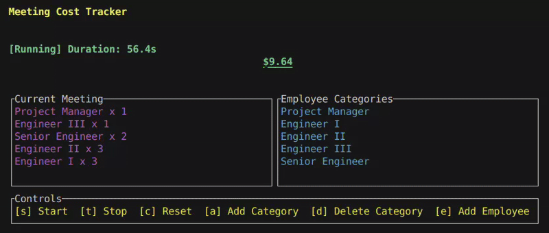

# Meeting Cost Tracker
[](https://crates.io/crates/meeting_cost_tracker)
[](https://docs.rs/meeting_cost_tracker)
[](https://github.com/Andrewsimsd/duplicate-file-finder/actions)
[](LICENSE)
[](https://github.com/Andrewsimsd/duplicate-file-finder)

**Meeting Cost Tracker** provides a Rust library and accompanying terminal user interface (TUI) for monitoring the real‑time cost of meetings. Costs are calculated from each attendee's salary and the time elapsed.

The library is lightweight and can be embedded in your own tools. A fully featured TUI application is also provided for quick tracking from the command line.



## Installation

### From crates.io

Add the library to your project with:

```console
$ cargo add meeting_cost_tracker
```

Install the standalone TUI application:

```console
$ cargo install meeting_cost_tracker
```

### From source

Clone the repository and build:

```console
$ git clone https://github.com/Andrewsimsd/meeting_cost_tracker
$ cd meeting_cost_tracker
$ cargo install --path .
```

## Example

```rust
use meeting_cost_tracker::{EmployeeCategory, Meeting};

let category = EmployeeCategory::new("Engineer", 120_000).unwrap();
let mut meeting = Meeting::new();
meeting.add_attendee(&category, 3);
meeting.start();
std::thread::sleep(std::time::Duration::from_secs(1));
meeting.stop();
println!("Cost: ${:.2}", meeting.total_cost());
```

## TUI Usage

Run the interactive tracker with:

```console
$ mct
```

Keyboard shortcuts:

- **s** – start the meeting
- **t** – stop the meeting
- **c** – reset accumulated time and cost
- **a** – add a new salary category
- **d** – delete an existing category
- **e** – add attendees
- **r** – remove attendees
- **w** – save attendees to a file
- **l** – load attendees from a file (opens file picker)
- **p** – toggle salary visibility
- **q** – quit

Categories are persisted to `data/categories.toml` next to the executable.
Attendee lists can be saved and loaded from the same directory using the **w** key.
Press **l** to open a file picker showing available attendee lists in that directory.

## See Also

- [`Meeting`](src/meeting.rs) – core meeting logic
- [`EmployeeCategory`](src/model.rs) – employee salary representation
- [`load_categories`](src/storage.rs) – persistence helpers

## License

Licensed under either the MIT license or Apache License 2.0 at your option.

